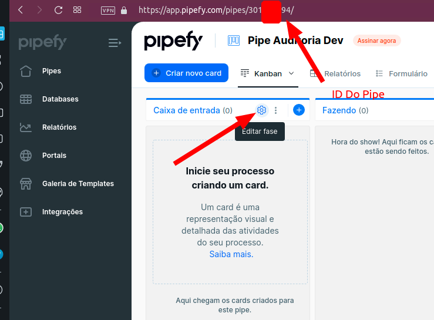
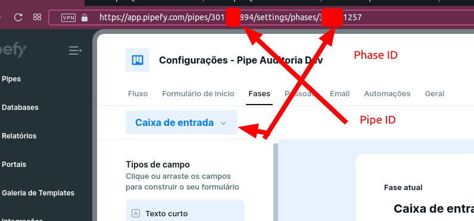
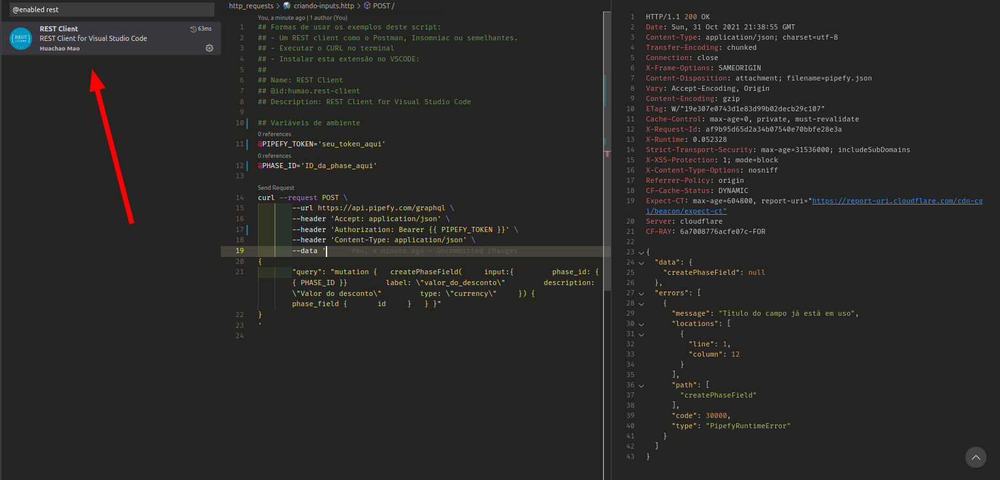

## Testando as queries

Teste os códigos em https://app.pipefy.com/graphiql

----


1. - Pegar os campos que precisa E o ID da fase (Phase)

No Pipe do qual quer copiar os campos, execute:

## code_01_01

```graphql
# 555555 é o ID do Pipe origem, do qual quer replicar os imputs
{
    pipes (ids: [555555])
    {
        # id
        # name
        start_form_fields {
          # phase { id }
          id
          label
          required
          type
          is_multiple
          options
        }
  }
}

```

A saída será algo semelhante à:

## code_01_02

```json
{
  "data": {
    "pipes": [
      {
        "start_form_fields": [
          {
            "id": "nome_do_cliente",
            "label": "Cliente",
            "required": false,
            "type": "short_text"
          },
          {
            "id": "email_cliente",
            "label": "Email cliente",
            "required": true,
            "type": "email"
          },
          {
            "id": "cnpj",
            "label": "CNPJ",
            "required": false,
            "type": "cnpj"
          },
          {
            "id": "tel",
            "label": "Tel",
            "required": true,
            "type": "phone"
          },
          {
            "id": "vencimento",
            "label": "Vencimento",
            "required": true,
            "type": "date"
          },
          {
            "id": "tipo",
            "label": "Tipo",
            "required": true,
            "type": "select"
          },
          {
            "id": "nome_do_desconto",
            "label": "Nome do Desconto",
            "required": false,
            "type": "short_text"
          },
          {
            "id": "valor_do_desconto",
            "label": "Valor do desconto",
            "required": false,
            "type": "currency"
          }
        ]
      }
    ]
  }
}
```


2. - Pegar os campos que precisa E o ID da fase (Phase)


## code_02_01

```graphql
## Para pegar o ID da Phase (e depois ver que seus campos foram criados com sucesso)
{
    pipes (ids: [6666666])
    {
        id
        name
        start_form_fields {
            phase { id }
            id
            label
            required
        }
  }
}
```
O retorno será algo como:

## code_02_02
```json
{
  "data": {
    "pipes": [
      {
        "id": "6666666",
        "name": "Pipe Auditoria Dev",
        "start_form_fields": [
          {
            "phase": {
              "id": "77777777"
            },
            "id": "email_cliente",
            "label": "email_cliente",
            "required": null
          }
        ]
      }
    ]
  }
}
```

> Agora você tem o ID da Phase que gostaria de adicionar mais fields.
> No exemplo seria o `77777777`


3. - Criando o campo com o ID e o tipo desejado (individualmente)

## code_03_01

```graphql
mutation
{
  createPhaseField(
    input:{
        phase_id: 77777777
        label: "valor_do_desconto"
        description: "Valor do desconto"
        type: "currency"
    }) {
    phase_field {
      id
    }
  }
}
```

> ! Nota:
> Os tipos aceitos são:

## code_03_02
```
assignee_select
attachment
checklist_horizontal
checklist_vertical
cnpj
connector
cpf
currency
date
datetime
due_date
email
id
label_select
long_text
number
phone
radio_horizontal
radio_vertical
select
short_text
statement
time
```
> Faço nem ideia do que são a maioria deles. Alguns tem suas regras mais específicas.
Para texto, customo utilizar `statement` que nem sei o que é ou `long/short_text`

Ao executar o `code_03_01`, o resultado será semelhante ao abaixo:

## code_03_03

```json
{
  "data": {
    "createPhaseField": {
      "phase_field": {
        "id": "valor_do_desconto"
      }
    }
  }
}

```

Teste executar o `code_02_01` e veja seus novos inputs.


----

## Tá, mas e como fazer isso 'programaticamente' ? ...

Uma alternativa seria você uilizar sua linguagem de progamação preferida, percorrer esse JSON `code_01_02` na chave `data.pipes.start_form_fields` e fazer uma chamada para cada um dos inputs alterando o código `code_03_01` para cada input.

Eu ([Tiago França](https://github.com/tiagofrancafernandes/)) sou essencialmente programador `PHP` (LINDÃO ❤), então faria com ele.

> [!] Se quiser ver alguns exemplos de request em outras linguagens, veja no link:
[https://developers.pipefy.com/reference/graphql-endpoint](https://developers.pipefy.com/reference/graphql-endpoint)

Segue alguns exemplos prontos:


----

## exemplo_01
```php
<?php

## PHP ex 1  - Via guzzle
## code_03_01


## Necessário baixar a dependência via composer
# composer require guzzlehttp/guzzle

require_once('vendor/autoload.php');

$client = new \GuzzleHttp\Client();

$response = $client->request('POST', 'https://api.pipefy.com/graphql', [
  'body' => '{"query":"mutation {   createPhaseField(     input:{         phase_id: 77777777         label: \\"valor_do_desconto\\"         description: \\"Valor do desconto\\"         type: \\"currency\\"     }) {     phase_field {       id     }   } }"}',
  'headers' => [
    'Accept' => 'application/json',
    'Authorization' => 'YOUR_TOKEN',
    'Content-Type' => 'application/json',
  ],
]);

echo $response->getBody();
## Fim do exemplo 1
################################

## PHP ex 2  - Via CURL do PHP
## code_03_01

$curl = curl_init();

curl_setopt_array($curl, [
  CURLOPT_URL => "https://api.pipefy.com/graphql",
  CURLOPT_RETURNTRANSFER => true,
  CURLOPT_ENCODING => "",
  CURLOPT_MAXREDIRS => 10,
  CURLOPT_TIMEOUT => 30,
  CURLOPT_HTTP_VERSION => CURL_HTTP_VERSION_1_1,
  CURLOPT_CUSTOMREQUEST => "POST",
  CURLOPT_POSTFIELDS => "{\"query\":\"mutation {   createPhaseField(     input:{         phase_id: 77777777         label: \\\"valor_do_desconto\\\"         description: \\\"Valor do desconto\\\"         type: \\\"currency\\\"     }) {     phase_field {       id     }   } }\"}",
  CURLOPT_HTTPHEADER => [
    "Accept: application/json",
    "Authorization: YOUR_TOKEN",
    "Content-Type: application/json"
  ],
]);

$response = curl_exec($curl);
$err = curl_error($curl);

curl_close($curl);

if ($err) {
  echo "cURL Error #:" . $err;
} else {
  echo $response;
}

## Fim do exemplo 2
################################
```
----

## exemplo_01

Em bash (shell script) oulinha de comando ficaria assim:

```sh
## Shell/bash  - Via CURL no terminal ou shell script
## Se for usar esta, uma forma interessante é usar o JQ (Linux) para ler json no terminal e percorrer os inputs
## code_03_01

curl --request POST \
     --url https://api.pipefy.com/graphql \
     --header 'Accept: application/json' \
     --header 'Authorization: YOUR_TOKEN' \
     --header 'Content-Type: application/json' \
     --data '
{
     "query": "mutation {   createPhaseField(     input:{         phase_id: 77777777         label: \"valor_do_desconto\"         description: \"Valor do desconto\"         type: \"currency\"     }) {     phase_field {       id     }   } }"
}
'
```
----

## exemplo_01

Em Javascript com `fetch` ficaria assim:

```js
// Javascript  - Via fetch.
// Dá pra fazer direto no console do navegador
// code_03_01

const options = {
  method: 'POST',
  headers: {
    Accept: 'application/json',
    Authorization: 'YOUR_TOKEN',
    'Content-Type': 'application/json'
  },
  body: JSON.stringify({
    query: 'mutation {   createPhaseField(     input:{         phase_id: 77777777         label: "valor_do_desconto"         description: "Valor do desconto"         type: "currency"     }) {     phase_field {       id     }   } }'
  })
};

fetch('https://api.pipefy.com/graphql', options)
  .then(response => response.json())
  .then(response => console.log(response))
  .catch(err => console.error(err));
```

----

### Screenshots







##### Rest client


